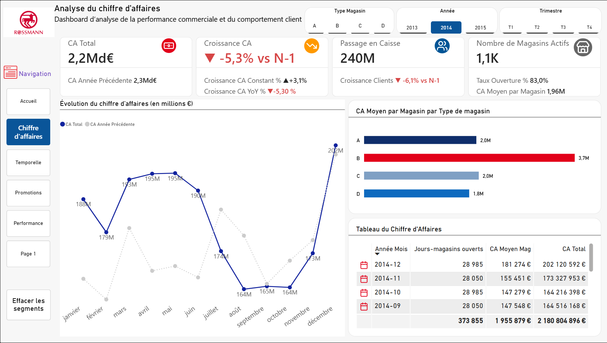
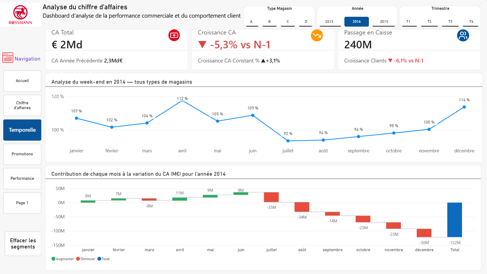
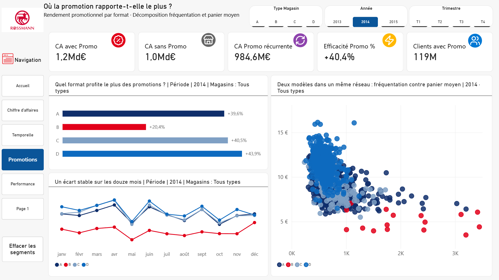

# Analyse de la performance retail — Rossmann

Rapport Power BI analysant l'activité commerciale de 1 115 magasins Rossmann
entre 2013 et 2015 : chiffre d'affaires, saisonnalité, fréquentation et
rendement des opérations promotionnelles.



---

## Le résultat qui a orienté toute l'analyse

Le chiffre d'affaires 2014 recule de **5,3 %** par rapport à 2013.

À périmètre constant, il progresse de **+3,1 %**.

L'écart ne vient pas de la performance des magasins mais du parc : le taux
d'ouverture tombe à 83 % sur l'année, avec une concentration des fermetures
sur le second semestre. Le graphique en cascade de la page *Temporelle*
localise précisément où se creuse l'écart — juillet à décembre concentrent
159 M€ des 122 M€ de variation nette.

C'est la distinction que le rapport cherche à rendre lisible : **un recul de
chiffre d'affaires n'est pas un recul de performance.**

---

## Le jeu de données

[Rossmann Store Sales](https://www.kaggle.com/competitions/rossmann-store-sales)
— jeu public, distribué sur Kaggle.

| Fichier | Contenu | Volume |
|---|---|---|
| `train.csv` | Ventes quotidiennes par magasin | ~1 million de lignes |
| `store.csv` | Caractéristiques des magasins | 1 115 lignes |
| `test.csv` | Période de prévision | ~41 000 lignes |

Période couverte : janvier 2013 à juillet 2015. Aucune donnée d'entreprise
réelle n'est utilisée dans ce projet.

---

## Les pages du rapport

### 1. Chiffre d'affaires


Vue d'ensemble commerciale : CA total, croissance à périmètre courant et
constant, fréquentation, parc actif. La courbe compare mois par mois l'année
sélectionnée à la précédente, et le tableau détaille le CA moyen par magasin
rapporté aux jours-magasins réellement ouverts — la seule base de comparaison
valable quand le parc bouge.

### 2. Analyse temporelle



Deux angles complémentaires. L'indice de week-end mesure le poids relatif du
samedi et du dimanche mois par mois : il passe de 117 % en avril à 93 % en
juillet, ce qui traduit un déplacement de la fréquentation vers la semaine
pendant l'été.

Le graphique en cascade décompose la variation annuelle mois par mois. Les
six premiers mois contribuent positivement, les six derniers effacent
l'avance et creusent un déficit de 122 M€.

### 3. Promotions



Le CA sous promotion atteint 1,2 Md€ contre 1,0 Md€ hors promotion, soit une
efficacité de **+40,4 %**.

Mais le rendement varie fortement selon le format : les types D (+43,9 %),
C (+40,5 %) et A (+39,6 %) répondent bien, le type B ne dégage que +20,4 %.

Le nuage de points fréquentation / panier moyen explique pourquoi : le
réseau abrite en réalité **deux modèles commerciaux distincts**. Les magasins
de type B fonctionnent sur un trafic élevé et un panier faible, les autres
sur l'inverse. Une mécanique promotionnelle uniforme ne peut pas donner le
même rendement sur les deux.

---

## Le modèle sémantique

Schéma en étoile, 4 tables utiles et 3 relations.

```
                    Dim_Calendrier
                          │
                          ▼
Dim_Magasin ──────▶ Fait_Historique des ventes ◀────── Dim_Prévisions
```

| Table | Rôle | Colonnes clés |
|---|---|---|
| `Fait_Historique des ventes` | Faits, grain magasin × jour | Chiffre d'affaires, Nombre de clients, Magasin ouvert, Promotion active |
| `Dim_Magasin` | Dimension magasin | ID Magasin, Type de magasin, Promo2 Active |
| `Dim_Calendrier` | Table de dates, marquée comme telle | Date, Annee, Trimestre, Mois, Jour Semaine No, Est Weekend |
| `Dim_Prévisions` | Périmètre de prévision | Date, ID Magasin |
| `_Mesures` | Table déconnectée regroupant les mesures | — |

### Choix techniques

**77 mesures DAX** organisées en dossiers d'affichage, structurées en deux
couches : une dizaine de mesures de base qui accèdent aux colonnes physiques,
et le reste qui ne référence que d'autres mesures. Cette séparation rend la
bibliothèque portable vers un autre modèle.

**Un groupe de calcul temporel** (Actuel, MTD, QTD, YTD, année précédente,
variation annuelle %) appliqué à l'ensemble des mesures. Six éléments au lieu
de six variantes par indicateur.

**Un paramètre de champs** (`Mesure Sélectionnée`) permettant de basculer
l'indicateur affiché dans les visuels sans dupliquer les pages.

**Une fonction DAX utilisateur** générant les badges d'icônes SVG utilisés
dans les cartes de KPI.

**Comparaison à périmètre constant** : toutes les moyennes sont rapportées
aux jours-magasins effectivement ouverts, pas aux jours calendaires. C'est ce
qui permet de séparer effet parc et effet performance.

---

## Ouvrir le rapport

1. Télécharger les fichiers CSV depuis
   [Kaggle](https://www.kaggle.com/competitions/rossmann-store-sales)
2. Cloner ce dépôt
3. Ouvrir `Projet_Analyse_Retail_Rossmann.pbip` avec Power BI Desktop
   (version de mai 2024 ou ultérieure)
4. Mettre à jour les chemins des sources dans Power Query

Le format `.pbip` stocke le rapport et le modèle en fichiers texte : le
contenu est lisible et comparable directement sur GitHub, contrairement au
`.pbix`. Chaque page, chaque visuel et chaque mesure est un fichier
consultable en ligne.

---

## Structure du dépôt

```
├── README.md
├── LICENSE
├── Projet_Analyse_Retail_Rossmann.pbip           Point d'entrée Power BI
├── Projet_Analyse_Retail_Rossmann.Report/        Pages et visuels
├── Projet_Analyse_Retail_Rossmann.SemanticModel/ Tables, relations, mesures
├── images/                                       Captures des pages
└── dax/
    ├── calendrier.dax           Table de dates continue et complète
    └── generateur-mesures.csx   Script Tabular Editor de génération
```

Le format `.pbip` sépare le rapport du modèle sémantique en deux dossiers de
fichiers texte. Le `.pbip` est le point d'entrée qui relie les deux : les
trois doivent rester au même niveau.

---

## Limites connues

Les données s'arrêtent en juillet 2015 : l'année 2015 est incomplète et ne
doit pas être comparée telle quelle aux années pleines.

Le jeu de données ne contient ni marge, ni catégorie de produit, ni coût
promotionnel. Les analyses portent sur le chiffre d'affaires et la
fréquentation, pas sur la rentabilité.

Le champ `Promo2` désigne une opération récurrente et se cumule avec les
promotions ponctuelles. Les deux effets ne sont pas isolés l'un de l'autre.

---

## Licence

MIT — voir [LICENSE](LICENSE).

